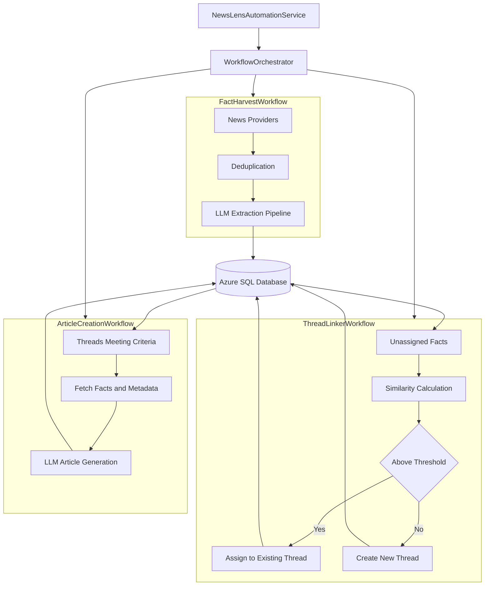

## NewsLens Architecture Overview
### Code contains selected parts of the NewsLens backend for Demo purposes. 

```mermaid
flowchart TB

    %% Top Level Control
    NAS[NewsLensAutomationService]
    WO[WorkflowOrchestrator]

    NAS --> WO

    %% Workflows
    subgraph FH[FactHarvestWorkflow]
        A1[News Providers]
        A2[Deduplication]
        A3[LLM Extraction Pipeline]
        A1 --> A2 --> A3
    end

    subgraph TL[ThreadLinkerWorkflow]
        B1[Unassigned Facts]
        B2[Similarity Calculation]
        B3{Above Threshold}
        B4[Assign to Existing Thread]
        B5[Create New Thread]
        B1 --> B2 --> B3
        B3 -->|Yes| B4
        B3 -->|No| B5
    end

    subgraph AC[ArticleCreationWorkflow]
        C1[Threads Meeting Criteria]
        C2[Fetch Facts and Metadata]
        C3[LLM Article Generation]
        C1 --> C2 --> C3
    end

    %% Orchestrator connections
    WO --> FH
    WO --> TL
    WO --> AC

    %% Database
    DB[(Azure SQL Database)]

    %% DB connections
    A3 --> DB
    DB --> B1
    B4 --> DB
    B5 --> DB
    DB --> C1
    C3 --> DB
```
